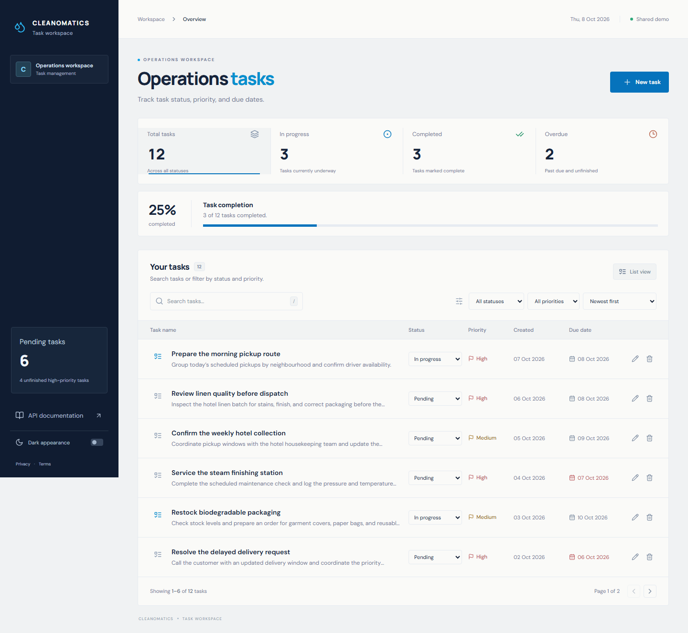

# Cleanomatics Task Workspace

A full-stack task manager built for the Cleanomatics developer assignment. Create, inspect, edit, and delete tasks in a responsive workspace using blue, navy, and off-white surfaces inspired by the company palette. Every task operation uses the Express REST API.

Repository: [aman-singh27/cleanomatics-task-workspace](https://github.com/aman-singh27/cleanomatics-task-workspace). Source is published. [Live workspace](https://cleanomatics-task-workspace.vercel.app) · [API](https://cleanomatics-task-api.onrender.com/api/tasks) · [Swagger](https://cleanomatics-task-workspace.vercel.app/api/docs/) · [Screenshots](output/playwright/). See the [deployment guide](docs/DEPLOYMENT.md) for configuration and acceptance checks.

## Run locally

Use Node.js **22.12 or newer** and npm. From the repository root:

```sh
npm ci
npm run dev
```

Open **http://127.0.0.1:5173**. The API runs at **http://127.0.0.1:4000/api**. Interactive Swagger documentation is at **http://127.0.0.1:4000/api/docs**.

Environment files are optional for the default local setup. Copy `backend/.env.example` to `backend/.env` and `frontend/.env.example` to `frontend/.env` when overriding configuration. Restart development servers after changing environment values.

## Features

- Dashboard with task descriptions, dates, status, priority, and live summary metrics.
- Change status directly in each task row or mobile card; summary counts and filtered results update after saving.
- Select All tasks, In progress, Completed, or Overdue through the dashboard metrics. Overdue shows unfinished tasks with a due date before today; it does not add a stored task status.
- Five-field create/edit forms with accessible validation, complete task details drawer, and named delete confirmation.
- Debounced search across title and description, combined status/priority filters, created-date/priority/due-date sorting, and pagination.
- Desktop table and mobile task cards, light/dark themes, keyboard-accessible dialogs, and reduced-motion support.
- Loading, empty, no-match, error/retry, save-progress, mutation-failure, and success states.
- Unknown-page recovery, a render-error fallback, and privacy/terms pages describing this evaluation demo.
- Centralized REST error handling, request validation, configured CORS, and OpenAPI documentation.

All seven assignment bonuses are implemented:

| Bonus            | Behavior                                                                        |
| ---------------- | ------------------------------------------------------------------------------- |
| Search           | Matches task title and description, case-insensitively                          |
| Filters          | Combines status and priority; summary shortcuts reset search, priority and page |
| Sorting          | Created date, priority, and due date; tasks without due dates sort last         |
| Pagination       | Six tasks per page, with page reset/clamping after filtering or deletion        |
| Dark mode        | Light/dark toggle with a saved theme preference                                 |
| Debounced search | Applies search after 300ms without another keystroke                            |
| API tooling      | Interactive Swagger UI and a machine-readable OpenAPI specification             |

For operational review, the API returns a generated `X-Request-Id`, uses privacy-safe JSON request logs, sends browser security headers, and marks task/health responses `Cache-Control: no-store`. Logs contain request ID, method, redacted route, status and duration; task contents, query values and raw headers are excluded. Production logging can be disabled with `REQUEST_LOGGING=false`. Shutdown drains accepted requests for up to ten seconds before closing remaining connections.

## Storage behavior

**Tasks live only in backend memory.** There is no database, Firebase, browser task persistence, or disk task persistence. All changes disappear when the backend restarts. By default, the server starts with example operations tasks. Set `SEED_DEMO_DATA=false` for an empty workspace. A restart with demo seeding enabled restores the examples, not previously created tasks. Only the theme preference is saved in browser localStorage.

No authentication is included because the assignment does not require it. The public demo shares one task collection across visitors and retains the reset-on-restart constraint. The backend runs as one Node process and one instance. Render's free service sleeps after 15 minutes without inbound traffic and can take about a minute to wake; backend memory is lost when the process stops. See [Render's free-service limits](https://render.com/docs/free).

## Verify

```sh
npx playwright install chromium
npm run check
```

`check` runs TypeScript checks, production build, frontend/backend tests with coverage, and Chromium end-to-end tests. E2E uses separate ports **4001/5174** and an empty API so it does not touch the local preview's tasks. Ensure those ports are free.

Individual commands:

```sh
npm test
npm run test:coverage
npm run test:e2e
npm run typecheck
npm run build
```

GitHub Actions runs the same checks on pushes and pull requests. Coverage HTML lives in each workspace's `coverage/` folder; Playwright writes `playwright-report/` and retains failure traces/screenshots.

## Architecture

```text
frontend/src/
  api/           Typed REST client
  hooks/         Task loading and mutation state
  lib/           Task selection, validation and date helpers
  components/    Reusable shell, list, form, drawer and dialog
backend/src/
  routes/        Endpoint registration
  controllers/   HTTP request/response handling
  services/      In-memory task store and demo seeds
  validation/    Input shape, enums, length and calendar-date checks
  middleware/    JSON errors, request IDs, safe logs and response headers
e2e/             Browser tests against real Express API
docs/            Plan, independent review, requirements, brand and API notes
```

The frontend obtains the task array from `GET /api/tasks` and performs search, filtering, sorting, and pagination locally. This keeps the assignment's REST contract straightforward and suits its small in-memory dataset. The list is reconciled after every successful mutation. Single-task details use `GET /api/tasks/:id`.

In development Vite proxies `/api` to Express. `API_PROXY_TARGET` changes that development proxy target. Hosted routing uses a Vercel external rewrite from `/api/:path*` to the Render backend's `/api/:path*`, keeping browser requests on the frontend origin. A specific `/api/docs/` rewrite preserves Swagger's directory URL before the SPA fallback. `VITE_API_URL` defaults to `/api`; a separate API base must also include `/api`. Backend `CORS_ORIGINS` allows the exact frontend origins. See the [deployment guide](docs/DEPLOYMENT.md).

## API

| Method | Endpoint         | Success          | Other expected responses |
| ------ | ---------------- | ---------------- | ------------------------ |
| GET    | `/api/tasks`     | 200 task array   | 500                      |
| GET    | `/api/tasks/:id` | 200 task         | 404                      |
| POST   | `/api/tasks`     | 201 task         | 400                      |
| PUT    | `/api/tasks/:id` | 200 task         | 400, 404                 |
| DELETE | `/api/tasks/:id` | 200 confirmation | 404                      |

See [API documentation](docs/API.md), Swagger at `/api/docs`, and the machine-readable specification at `/api/openapi.json`.

## Review and deliverables

Start with the [manual review guide](docs/MANUAL-REVIEW.md). The [requirements matrix](docs/REQUIREMENTS.md) traces assignment requirements; the [verification report](docs/VERIFICATION.md) records executed checks and screenshots. [Brand research](docs/BRAND-RESEARCH.md) records observed company design cues. The app uses an original identity illustration and interface; no company assets are copied.

GitHub source and both services are published. The employer requested the GitHub link by **9 October 2026, end of day**. The [submission checklist](docs/SUBMISSION-CHECKLIST.md) maps all six deliverables and seven bonuses. The latest GitHub Actions run passed 149 tests. All 14 hosted checks passed against real services, including UI CRUD, mobile/theme controls, sorting/filtering, Swagger execution, and error contracts; [machine-readable evidence](docs/hosted-verification.json) records the run. Browser coverage is Chromium; other browsers and physical devices have not been tested.

## Screenshots



[Dark desktop](output/playwright/desktop-dark.png) · [Mobile](output/playwright/mobile-light.png) · [Dark mobile](output/playwright/mobile-dark.png) · [Task details](output/playwright/task-details.png) · [Mobile task form](output/playwright/mobile-form.png)

Refresh the screenshots with `npm run screenshots` after starting the default local frontend. For a different port or the hosted demo, set `PREVIEW_URL` before running that command. Hosted smoke checks can be repeated with `node scripts/verify-deployment.mjs --live-url https://cleanomatics-task-workspace.vercel.app --api-url https://cleanomatics-task-api.onrender.com/api`; they create and remove only their own uniquely identified test task.
