# Task workspace screenshot gallery

[Live workspace](https://cleanomatics-task-workspace.vercel.app) · [Project README](../../README.md) · [Swagger](https://cleanomatics-task-workspace.vercel.app/api/docs/)

Overview views: [Light desktop](desktop-light.png) · [Dark desktop](desktop-dark.png) · [Light mobile](mobile-light.png) · [Dark mobile](mobile-dark.png) · [Task details](task-details.png) · [Mobile task form](mobile-form.png).

The walkthrough below follows one sample task through creation, editing, status changes and deletion, then shows the supporting workspace views. Task changes use the actual Express REST API. The capture script removes only its own temporary task ID; existing workspace tasks are preserved.

## 1. Required-field validation

The create form associates feedback with the required title and description fields.

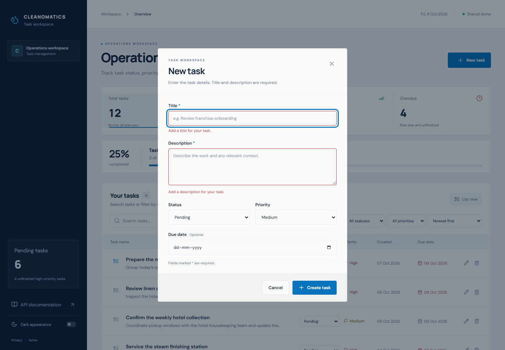

## 2. Add a task

The form contains title, description, status, priority and an optional due date.

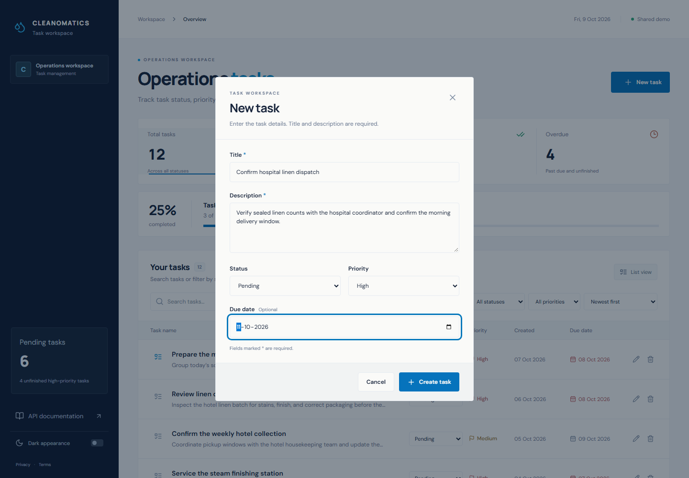

## 3. Task created

The new task appears in the workspace after saving.

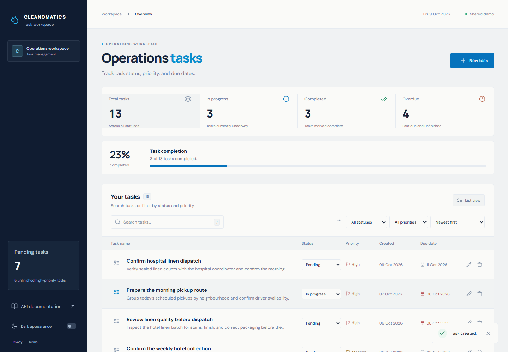

## 4. Edit the task

The edit form opens the existing task's fields for changes.

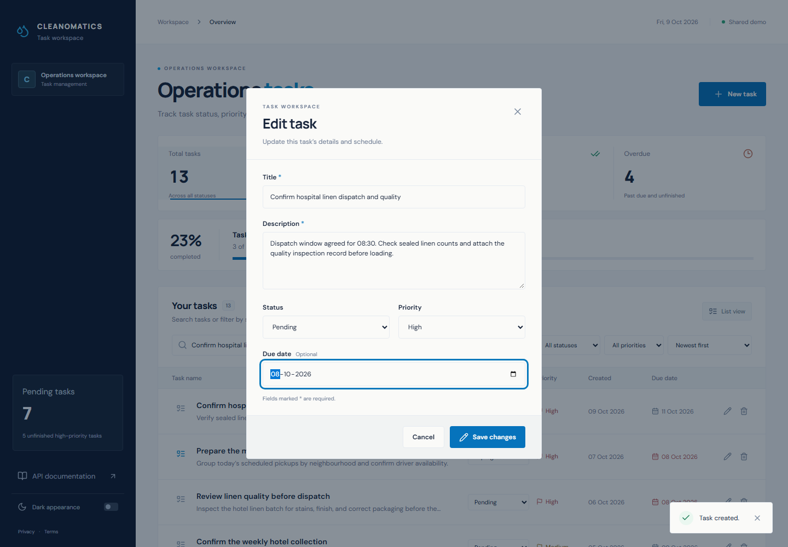

## 5. Changes saved

The workspace displays the updated task values.


## 6. Change status to In progress

The row's status control updates the task without opening the edit form.

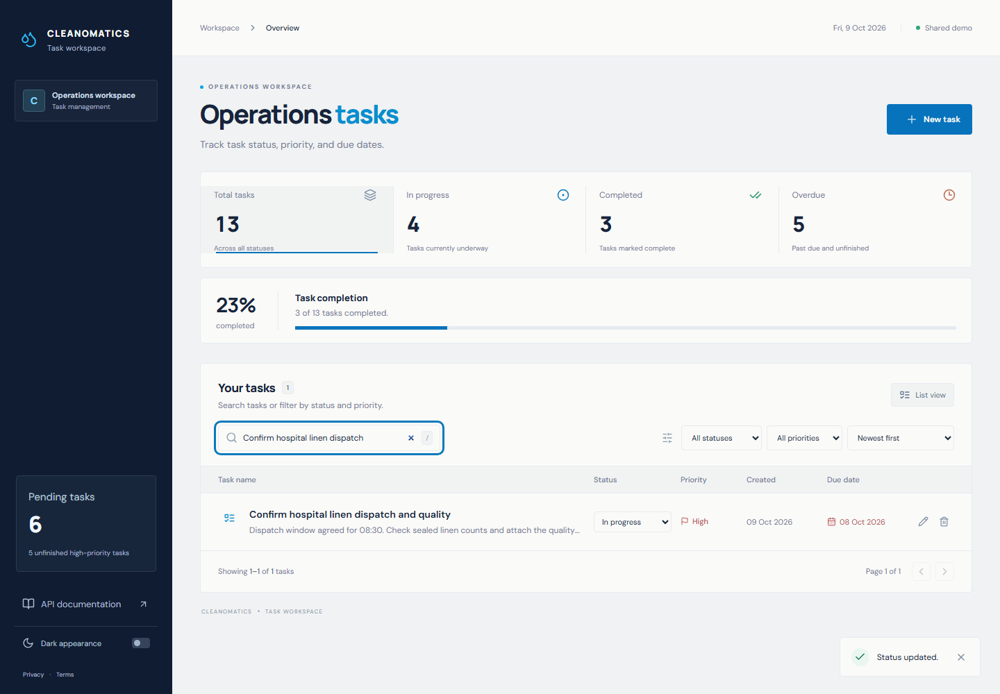

## 7. Complete the task

The same inline control changes the task to Completed.

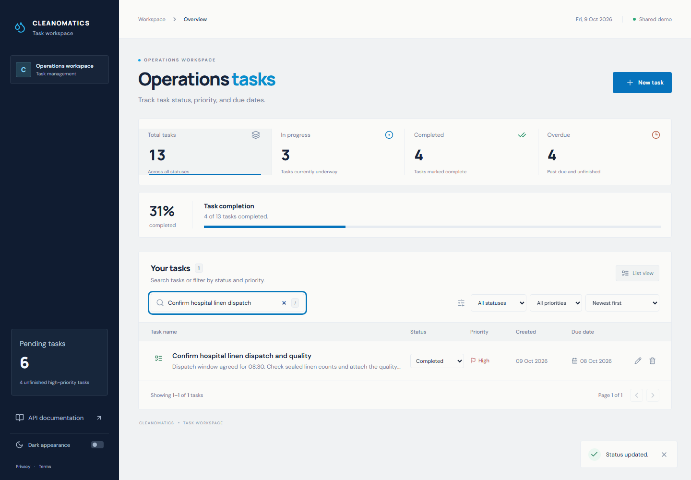

## 8. Search and filter

Search works with status and priority filters to narrow the list.

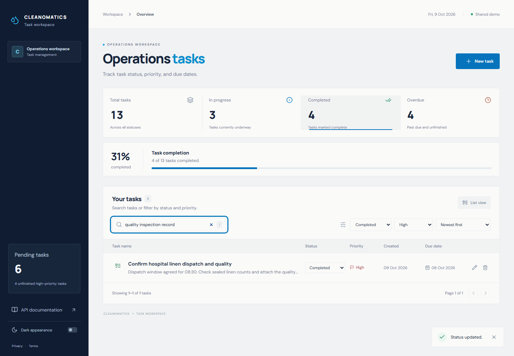

## 9. Find overdue work

The Overdue metric selects unfinished tasks whose due dates have passed.

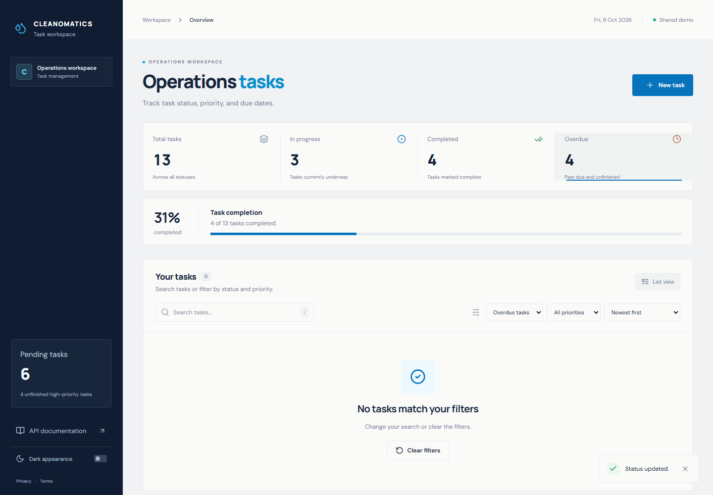

## 10. Browse another page

Pagination keeps the list to six tasks per page.

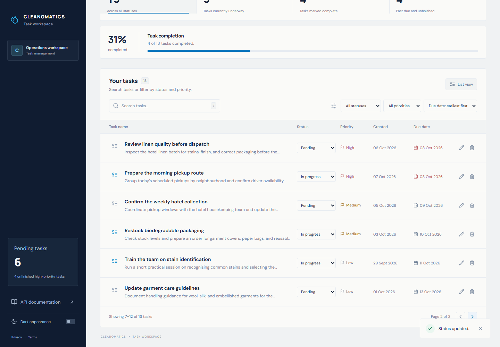

## 11. Edit on mobile

The task form remains usable in a narrow mobile viewport.

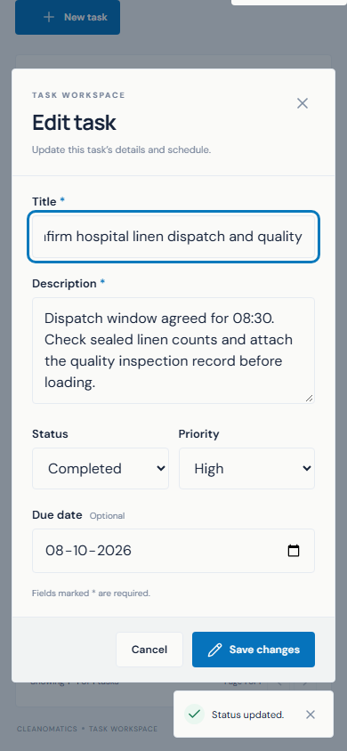

## 12. Confirm deletion

The confirmation names the task and offers a choice to keep it or delete it.

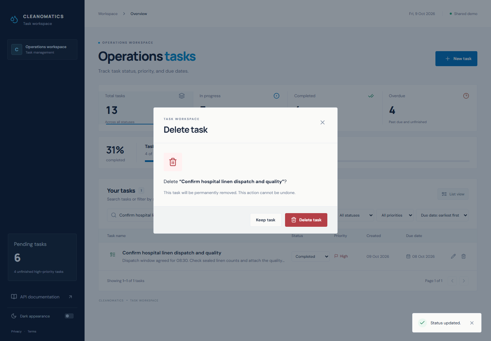

## 13. Task deleted

The deleted sample task is removed from the workspace.

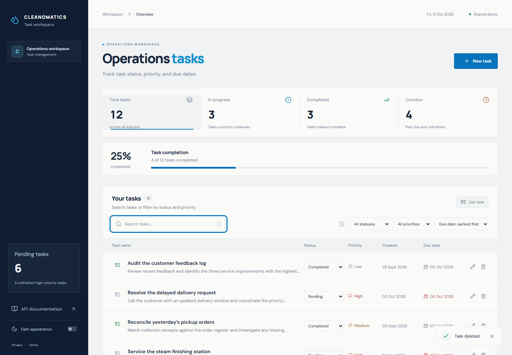

## 14. No matching tasks

An unmatched search displays a clear recovery action.

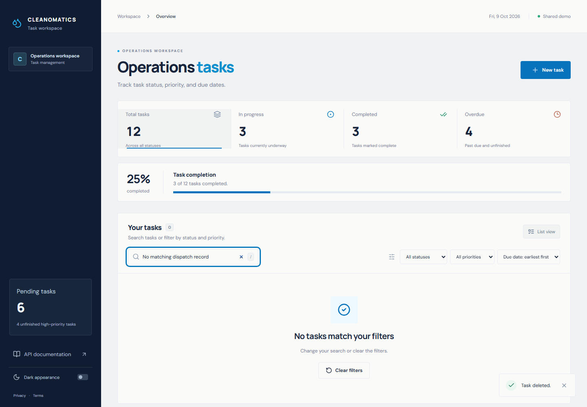

## 15. Interactive API documentation

Swagger presents the REST operations, schemas and controls for trying requests.

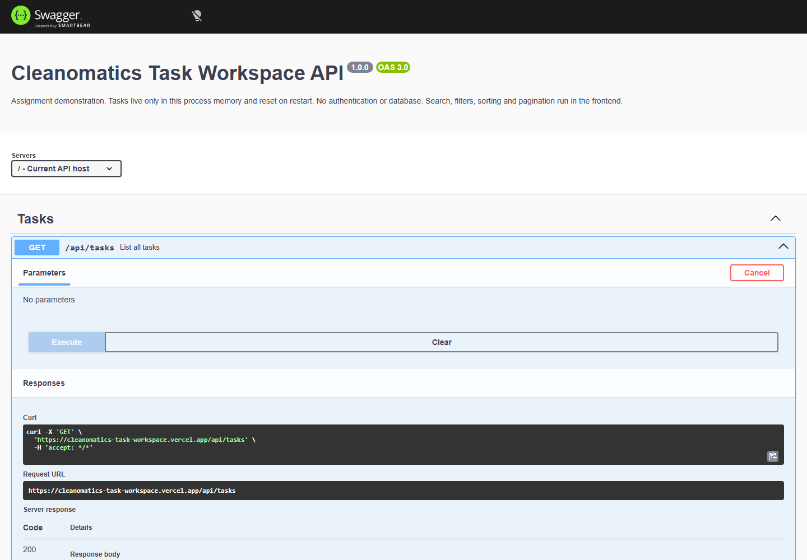

## 16. Unknown-page recovery

An unknown frontend path offers a route back to the task workspace.

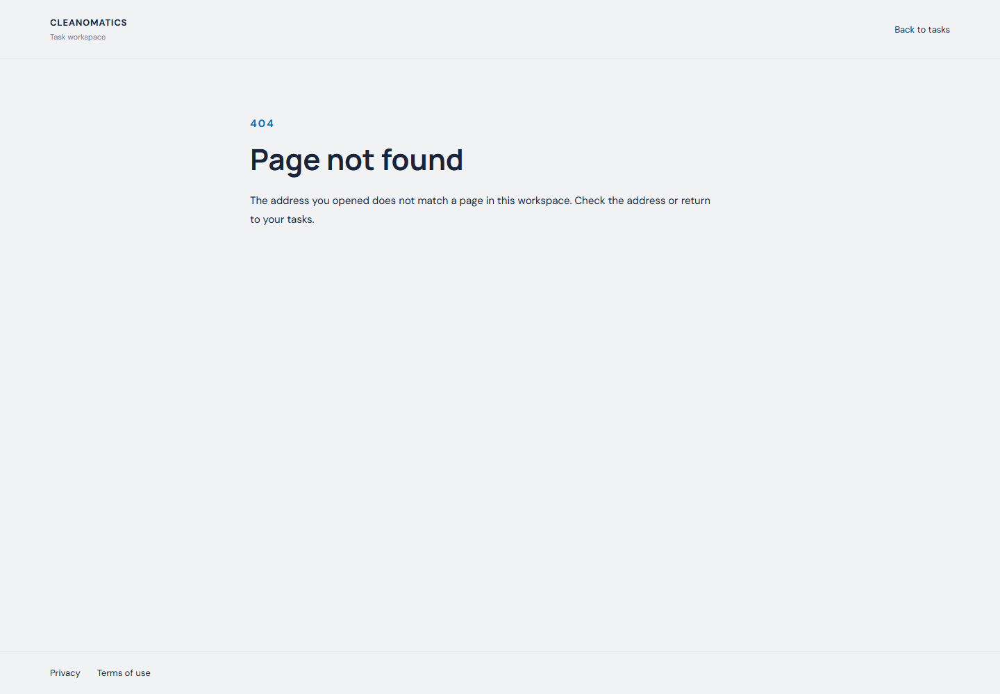

## Refresh the images

Start the default local frontend/API with `npm run dev`, then run:

```sh
npm run screenshots
npm run screenshots:workflows
```

Both commands default to `http://127.0.0.1:5173`. To use the hosted app, set `PREVIEW_URL` before running the command; in PowerShell:

```powershell
$env:PREVIEW_URL = 'https://cleanomatics-task-workspace.vercel.app'
npm run screenshots:workflows
```

The workflow command performs real create/update/delete operations on its own temporary sample task. Only the theme preference is stored in the browser; task records remain in backend memory.
